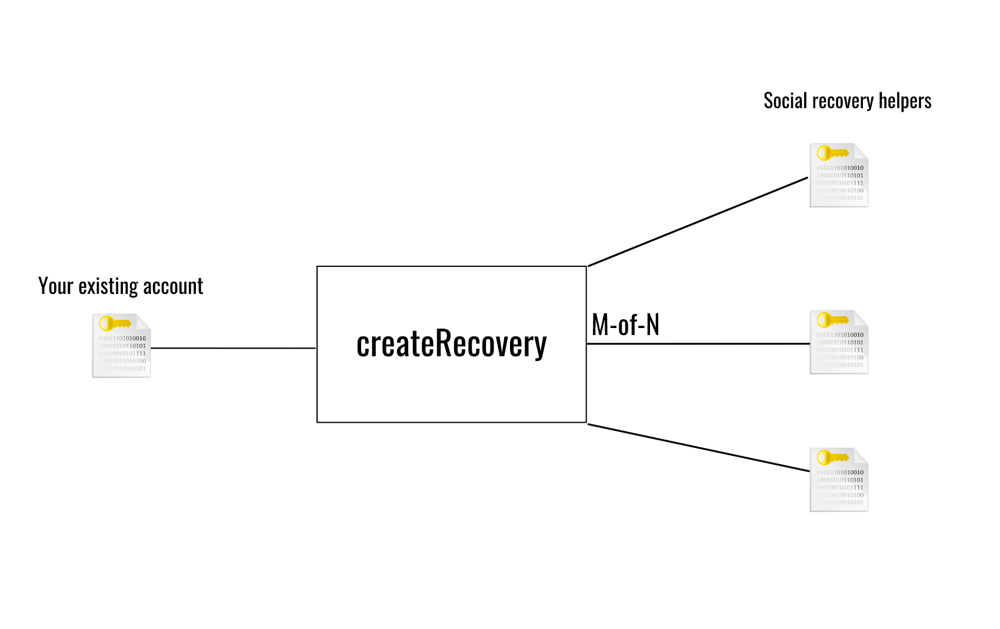
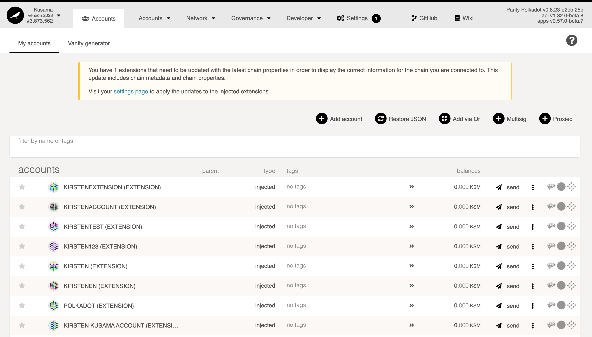
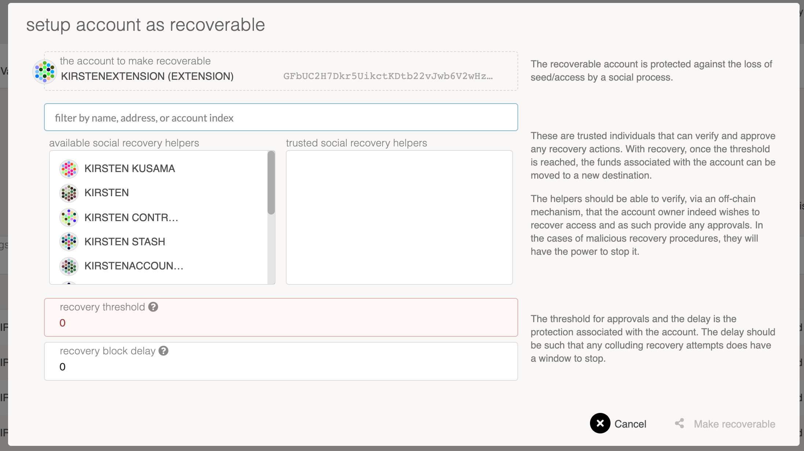
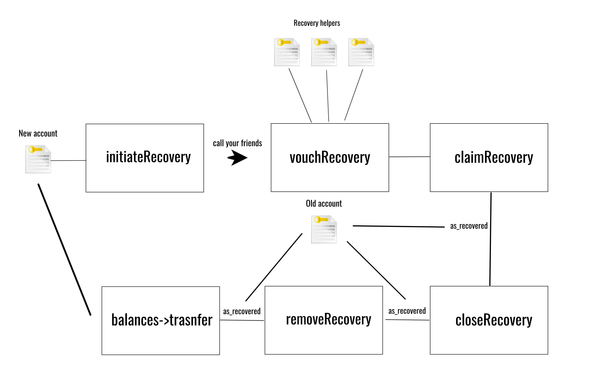
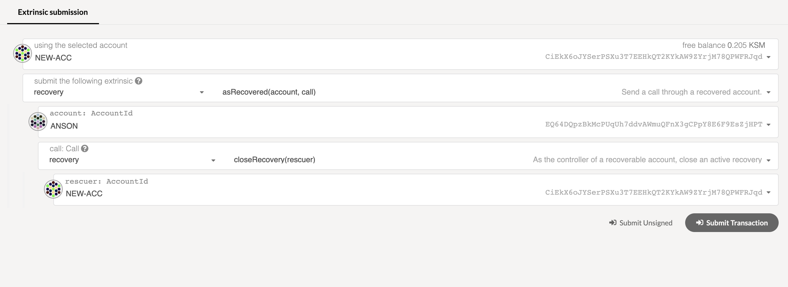
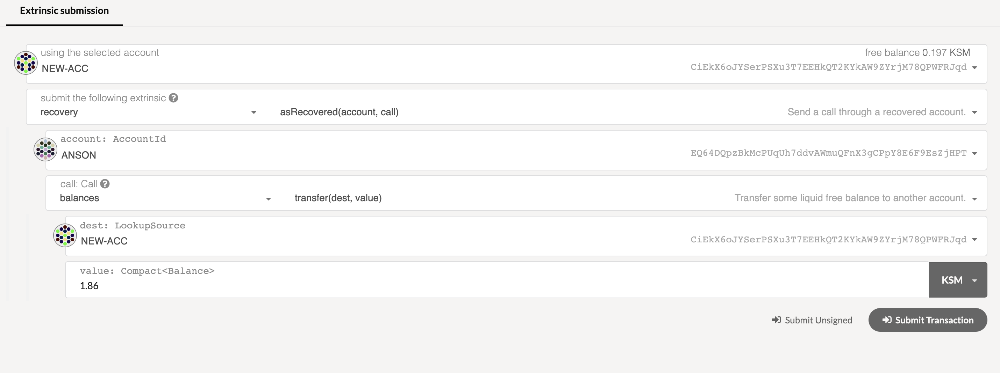

Managing an account is not an easy task. Many people have lost their private keys due to improper
key management over the past few years. Kusama provides a method that allows users to recover their
accounts by setting up a social recovery. It is an M-of-N recovery tool based on the multi-signature
wallet to get back access to your lost account.

caution There is no way to get back your private key by using this method

This is just a way of performing transactions on behalf of the lost account, so you can think of it
as a proxy instead.

In this guide, you will learn how to create a recoverable account, how to recover it, and what you
need to be aware of when using it.

## Create a Recoverable Account

You will use your existing account to call `createRecovery` to select a list of accounts you trust
to help you recover the account when you lose the private key. To create a recoverable account, you
will be required to set a `threshold` that is the number of your friends who need to approve the
recovery process to recover your account.

!!!note Account Recovery

If you are recovering an account, ensure that your network is set to Kusama. You can do this by
selecting the network from the top right corner in the Polkadot-JS UI.

First, see the [Accounts](https://polkadot.js.org/apps/#/accounts) page on Polkadot-JS Apps that
shows all available accounts on your browser's local storage and Polkadot-JS extension. To create a
recoverable account, make sure you have some KSM to pay the transaction fees. You You will also need
some for the reserve required by the account recovery setup.

Then, click the menu beside the "send" button, and choose "Make recoverable".

Now you need to provide the following information:

`trusted social recovery helpers` - A list of accounts that you trust. These can help you if you
lose the private key. Since setting up a recoverable account requires you to lock up KSM, ensure
your account has enough transferable balance to cover it. As you select additional recovery helpers,
more KSM will be required.

`recovery threshold` - The number of friends required to submit a `vouchRecovery` transaction in
order to recover the account.

!!!info
1 is the minimum, but it is not recommended to set a small number. If you set 1, that means any of
your recovery helpers would be able to recover your account.

`recovery block delay` - Once the threshold is reached, you will need to wait until the block delay
has passed until you can claim the recovery. This is a protection mechanism to allow the account
owner to have enough time to check and react in case someone pretends to be you and initiates a
recovery process.

!!!info
Setting the block delay to be a little longer would be better since even if an attacker acquired
enough signatures to recover your account, they would still have to wait until the block delay is
passed to control your account.

## Recover your Account

This section would be showing you how to initiate a recovery process and get back the balance that
held in the lost account to the new account.

The above diagram shows the whole process of recovering an account.

!!!info
Ensure that your new account has enough KSM to pay for the transaction fees and the amount that is
used for reserve when making a recovery.

Navigate to the menu beside the send button in the row of your new account and click the "Initiate
recover for another" option.

Then input the address you would like to recover in the "recover this account" field and click
"Start recovery".

Once the transaction went through, some KSM will be locked to prevent malicious behavior.

Now call your friends that you have set in the first section, but heading over to "Developer" >
"Extrinsics" and using the recovery pallet. They are required to submit a `vouchRecovery`
transaction.

Once the threshold is reached and the block delay is passed, use the new account to submit a
`claimRecovery` transaction that would set a proxy on behalf of your lost account. It means that you
can still indirectly use the lost account to interact with the network.

To see the proxy information, use your new account by calling the "recovery->proxy(Accountid)"
function at the [Chain state](https://polkadot.js.org/apps/#/chainstate) page. It should point to
your lost account.

Next, in order to call the "closeRecovery" transaction, you can make use of the "asRecovered"
function as your lost account to get the locked KSM.

Once the transaction goes through, the reserved KSM from the "NEW-ACC" will have been moved to the
lost account. This is a way of preventing someone from recovering other accounts maliciously.
Imagine if someone tried to initiate recovery on your account; you can do this to slash their locked
KSM.

Moving on, we use the `asRecovered` function to submit the `removeRecovery` transaction on behalf of
the lost account to release the reserved KSM from your lost account.

Now your account balance should be transferable.

Finally, transfer all of your available balance from the lost account to the new account.

The recovery process is now complete and successful.

!!!tip Using `Root` origin

There is still one possible way to recover the account without going through the recovery process.
That is by using the `Root` origin. However, in order to use root permissions, you will need to
either go through [governance](../../learn/learn-polkadot-opengov.md).

## Further Reading

- [Substrate's Recovery Pallet](https://github.com/paritytech/polkadot-sdk/blob/master/substrate/frame/recovery/src/lib.rs) -
  The Rust implementation of the recovery pallet.
