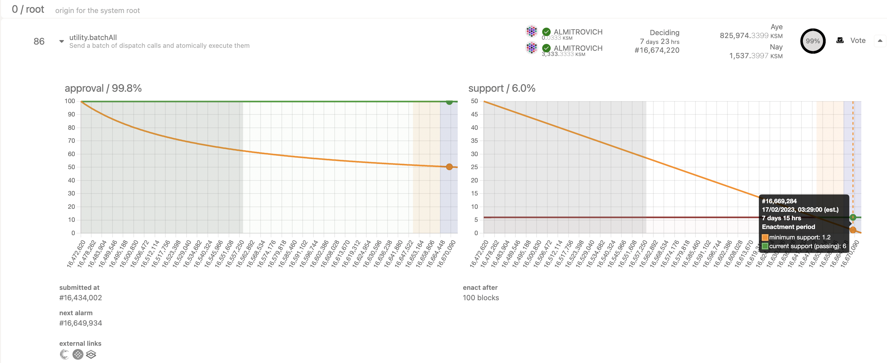

import Tracks from "./../../components/Referenda-Tracks"; import Chart from
"./../../components/Chart";

!!!info "Learn more about Polkadot OpenGov"
    For background information about Polkadot OpenGov, please refer to this [dedicated Wiki document](../learn/learn-polkadot-opengov.md).

## Polkadot OpenGov Terminology and Parameters

The important parameters to be aware of when voting using the Referenda module are as follows:

**Origin** - Each origin has a fixed set of privileges. When making a proposal, it is important to
choose the origin that has the privilege to execute the referenda.

**Track** - Each track has its own dispatch origin and a preset configuration that governs the
voting process and parameters.

**Submission Deposit** - The minimum amount to be used as a (refundable) deposit to submit a public
referendum proposal.

**Prepare Period** - The minimum time the referendum needs to wait before it can progress to the
next phase after submission. Voting is enabled, but the votes do not count toward the outcome of the
referendum yet.

**Decision Deposit** - This deposit is required for a referendum to progress to the decision phase
after the end of prepare period.

**Decision Period** - Amount of time a decision may take to be approved to move to the confirming
period. If the proposal is not approved by the end of the decision period, it gets rejected.

**Max Deciding** - The maximum number of referenda that can be in the decision period of a track all
at once.

**Conviction**: A multiplier to increase voting power.

**Approval**: the share of the approval vote-weight after adjustments for conviction against the
total number of vote-weight for both approval and rejection

**Support**: The total number of votes in approval (ignoring adjustments for conviction) compared to
the total possible amount of votes that could be made in the system. Support also takes into account
abstained votes.

**Min Approval** - The threshold of approval (along with the min support) needed for a proposal to
meet the requirements of the confirm period.

**Min Support** - The threshold of support (along with the min approval) needed for a proposal to
meet the requirements of the confirm period.

**Confirmation Period** - The total time the referenda must meet both the min approval and support
criteria during the decision period in order to pass and enter the enactment period.

**Min Enactment Period** - Minimum time that an approved proposal must be in the dispatch queue
after approval. The proposer has the option to set the enactment period to be of any value greater
than the min enactment period.

## Origins and Tracks Info

=== "Polkadot"

    <Tracks network="polkadot" defaultValue="Loading Polkadot Tracks..."/>

=== "Kusama"

    <Tracks network="kusama" defaultValue="Loading Kusama Tracks..."/>

!!!info
    For every referendum in each of these tracks, the Polkadot-JS UI displays interactive graphs of the support and approval.

### Root

=== "Polkadot"

    The origin with the highest level of privileges. This track requires extremely high levels of
    approval and support for early passing. The prepare and enactment periods are also large. For
    instance, a referendum proposed in this track needs to amass 48.2% support (total network issuance)
    by the end of the first day with over 93.5% approval to be considered to be part of the confirm
    period. The support curve drops linearly to 25% by the end of day 14 and almost to 0% by the end of
    day 28. This ensures that the token holders receive ample time to vote on the proposal during the
    decision period.

    <Chart title="" type="line" dataId="Root" network="Polkadot" maxX="672" maxY="100" />

=== "Kusama"

    The origin with the highest level of privileges. This track requires extremely high levels of
    approval and support for early passing. The prepare and enactment periods are also large. For
    instance, a referendum proposed in this track needs to amass 46.8% support (total network issuance)
    by the end of the first day with over 88% approval to be considered to be part of the confirm
    period. The support curve drops linearly to 25% by the end of day 7 and almost to 0% by the end of
    day 14. This ensures that the token holders receive ample time to vote on the proposal during the
    decision period.

    <Chart title="" type="line" dataId="Root" network="Kusama" maxX="336" maxY="100" />

### Whitelisted Caller

=== "Polkadot"

    Origin commanded by the [Fellowship](../learn/learn-polkadot-technical-fellowship.md) whitelist some
    hash of a call and allow the call to be dispatched with the root origin (after the referendum
    passes). This track allows for a shorter voting turnaround, safe in the knowledge through an open
    and transparent process for time-critical proposals. For instance, a referendum proposed in this
    track needs to amass 20% :polkadot support (much lesser than the root) by the end of the first day
    with over 93.5% approval to be considered to be part of the confirm period. **Note how no referendum
    on the Whitelisted track can ever pass with less than 5% support.**

    <Chart title="" type="line" dataId="Whitelist" network="Polkadot" maxX="672" maxY="100" />

=== "Kusama"

    Origin commanded by the [Fellowship](../learn/learn-polkadot-technical-fellowship.md) whitelist some
    hash of a call and allow the call to be dispatched with the root origin (after the referendum
    passes). This track allows for a shorter voting turnaround, safe in the knowledge through an open
    and transparent process for time-critical proposals. For instance, a referendum proposed in this
    track needs to amass 14% support (much lesser than the root) by the end of the first day with over
    88% approval to be considered to be part of the confirm period. **Note how no referendum on the
    Whitelisted track can ever pass with less than 5% support.**

    <Chart title="" type="line" dataId="Whitelist" network="Kusama" maxX="336" maxY="100" />

### Wish For Change

The Wish For Change track serves as a medium for gathering consensus through OpenGov on a proposed
change to the network through an [on-chain remark](../general/glossary.md#remarks). This track was
added to ensure the Root track, which is typically utilized for handling one referendum at a time
due to the sensitive nature of Root calls, is not employed to convey network desires to various
bodies within the network. These remark statements could be voted on simultaneously because they
lack stateful logic impacting the network. They should not delay voting on proposals requiring Root
or be obligated to its queue. The approval/support criteria resemble Root, and passing items on this
track serves as a signal for a change without conferring privileges.

=== "Polkadot"

    <Chart title="" type="line" dataId="Root" network="Polkadot" maxX="672" maxY="100" />

=== "Kusama"

    <Chart title="" type="line" dataId="Root" network="Kusama" maxX="336" maxY="100" />

### Staking Admin

The origin for canceling [slashes](./learn-offenses.md). This origin has the privilege to execute
calls from the staking pallet and the Election Provider Multiphase Pallet.

=== "Polkadot"

    <Chart title="" type="line" dataId="AdminStaking" network="Polkadot" maxX="672" maxY="100" />

=== "Kusama"

    <Chart title="" type="line" dataId="AdminStaking" network="Kusama" maxX="336" maxY="100" />

### Treasurer

=== "Polkadot"

    The origin for spending funds from the treasury (up to 10M DOT). This origin has the privilege to
    execute calls from the Treasury pallet.

    <Chart title="" type="line" dataId="Treasurer" network="Polkadot" maxX="672" maxY="100" /> :polkadot

=== "Kusama"

    The origin for spending funds from the treasury (up to 333333.33 KSM). This origin has the privilege
    to execute calls from the Treasury pallet.

    <Chart title="" type="line" dataId="Treasurer" network="Kusama" maxX="336" maxY="100" />

### Lease Admin

Origin can force slot leases. This origin has the privilege to execute calls from the Slots pallet.

=== "Polkadot"

    <Chart title="" type="line" dataId="AdminLease" network="Polkadot" maxX="672" maxY="100" />

=== "Kusama"

    <Chart title="" type="line" dataId="AdminLease" network="Kusama" maxX="336" maxY="100" />

### Fellowship Admin

The origin for managing the composition of the fellowship.

=== "Polkadot"

    <Chart title="" type="line" dataId="AdminFellowship" network="Polkadot" maxX="672" maxY="100" />

=== "Kusama"

    <Chart title="" type="line" dataId="AdminFellowship" network="Kusama" maxX="336" maxY="100" />

### General Admin

The origin managing the registrar and permissioned HRMP channel operations.

=== "Polkadot"

    <Chart title="" type="line" dataId="AdminGeneral" network="Polkadot" maxX="672" maxY="100" />

=== "Kusama"

    <Chart title="" type="line" dataId="AdminGeneral" network="Kusama" maxX="336" maxY="100" />

### Referendum Canceller

The origin can cancel referenda. This track has a low lead time and approval/support curves with
slightly sharper reductions in their thresholds for passing.

=== "Polkadot"

    <Chart title="" type="line" dataId="RefCanceller" network="Polkadot" maxX="672" maxY="100" />

=== "Kusama"

    <Chart title="" type="line" dataId="RefCanceller" network="Kusama" maxX="336" maxY="100" />

### Referendum Killer

The origin can cancel an ongoing referendum and slash the deposits. This track also has a low
lead-time and approval/support curves with slightly sharper reductions in their thresholds for
passing.

=== "Polkadot"

    <Chart title="" type="line" dataId="RefKiller" network="Polkadot" maxX="672" maxY="100" />

=== "Kusama"

    <Chart title="" type="line" dataId="RefKiller" network="Kusama" maxX="336" maxY="100" />

### Small Tipper

=== "Polkadot"

    Origin able to spend up to 250 DOT from the treasury at once.

    <Chart title="" type="line" dataId="SmallTipper" network="Polkadot" maxX="672" maxY="100" />

=== "Kusama"

    Origin able to spend up to 8.25 KSM from the treasury at once.

    <Chart title="" type="line" dataId="SmallTipper" network="Kusama" maxX="336" maxY="100" />

### Big Tipper

=== "Polkadot"

    Origin able to spend up to 1000 DOT from the treasury at once.

    <Chart title="" type="line" dataId="BigTipper" network="Polkadot" maxX="672" maxY="100" />

=== "Kusama"

    Origin able to spend up to 33.33 KSM from the treasury at once.

    <Chart title="" type="line" dataId="BigTipper" network="Kusama" maxX="336" maxY="100" />

### Small Spender

=== "Polkadot"

    Origin able to spend up to 10000 DOT from the treasury at once.

    <Chart title="" type="line" dataId="SmallSpender" network="Polkadot" maxX="672" maxY="100" />

=== "Kusama"

    Origin able to spend up to 333.33 KSM from the treasury at once.

    <Chart title="" type="line" dataId="SmallSpender" network="Kusama" maxX="336" maxY="100" />

### Medium Spender

=== "Polkadot"

    Origin able to spend up to 100000 DOT from the treasury at once.

    <Chart title="" type="line" dataId="MediumSpender" network="Polkadot" maxX="672" maxY="100" />

=== "Kusama"

    Origin able to spend up to 3333.33 KSM from the treasury at once.

    <Chart title="" type="line" dataId="MediumSpender" network="Kusama" maxX="336" maxY="100" />

### Big Spender

=== "Polkadot"

    Origin able to spend up to 1000000 DOT from the treasury at once.

    <Chart title="" type="line" dataId="BigSpender" network="Polkadot" maxX="672" maxY="100" />

=== "Kusama"

    Origin able to spend up to 33333.33 KSM from the treasury at once.

    <Chart title="" type="line" dataId="BigSpender" network="Kusama" maxX="336" maxY="100" />
