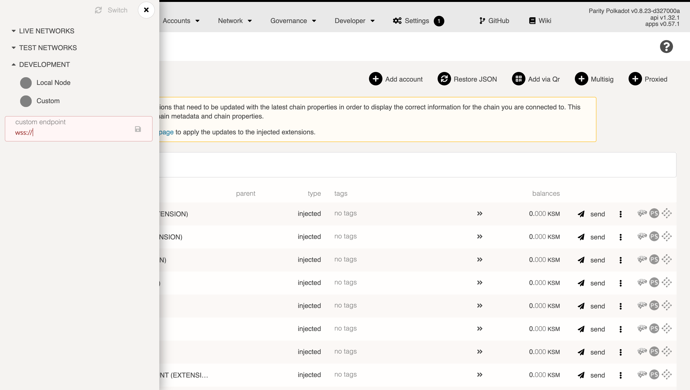

## Secure a WS Port

A non-secure ws port can be converted to a secure wss port by placing it behind an SSL-enabled
proxy. This can be used to secure a [bootnode](./maintain-bootnode.md) or secure a
[RPC server](./maintain-rpc.md). The SSL-enabled apache2/nginx/other proxy server redirects
requests to the internal ws and converts it to a secure (wss) connection. For this, you will need an
SSL certificate for which you can use a service like letsencrypt or self-signing.

### Obtaining an SSL Certificate

One easy way to get a free SSL certificate can be achieved by following the LetsEncrypt instructions
([nginx](https://certbot.eff.org/instructions?ws=nginx&os=ubuntufocal)/[apache](https://certbot.eff.org/instructions?ws=apache&os=ubuntufocal)).
This will auto-generate an SSL certificate and include it in your configuration.

Alternatively, you can generate a self-signed certificate and rely on the raw IP address of your
node when connecting to it. This is not preferable since you will have to whitelist the certificate
to access it from a browser.

```bash
sudo openssl req -x509 -nodes -days 365 -newkey rsa:2048 -keyout /etc/ssl/private/selfsigned.key -out /etc/ssl/certs/selfsigned.crt
sudo openssl dhparam -out /etc/ssl/certs/dhparam.pem 2048
```

## Installing a Proxy Server

There are a lot of different implementations of a WebSocket proxy, some of the more widely used are
[nginx](https://www.nginx.com/) and [apache2](https://httpd.apache.org/), for which configuration
examples provided below.

### Nginx

```bash
apt install nginx
```

In an SSL-enabled virtual host add:

```conf
server {
  (...)
  location / {
    proxy_buffers 16 4k;
    proxy_buffer_size 2k;
    proxy_pass http://localhost:9944;
    proxy_http_version 1.1;
    proxy_set_header Upgrade $http_upgrade;
    proxy_set_header Connection "Upgrade";
    proxy_set_header Host $host;
   }
}
```

Optionally some form of rate limiting can be introduced:

```conf
http {
  limit_req_zone  "$http_x_forwarded_for" zone=zone:10m rate=2r/s;
  (...)
}

location / {
  limit_req zone=zone burst=5;
  (...)
}
```

### Apache2

You can run it in different modes such as prefork, worker, or event. In this example, we use
[event](https://httpd.apache.org/docs/2.4/mod/event.html) which works well on higher load
environments but other modes are also useful given the requirements.

```bash
apt install apache2
a2dismod mpm_prefork
a2enmod mpm_event proxy proxy_html proxy_http proxy_wstunnel rewrite ssl
```

The [mod_proxy_wstunnel](https://httpd.apache.org/docs/2.4/mod/mod_proxy_wstunnel.html) provides
_support for the tunneling of web socket connections to a backend websockets server. The connection
is automatically upgraded to a WebSocket connection_. In an SSL-enabled virtualhost add:

```apacheconf
(...)
SSLProxyEngine on
ProxyRequests off

ProxyPass / ws://localhost:9944
ProxyPassReverse / ws://localhost:9944
```

Older versions of mod_proxy_wstunnel do not upgrade the connection automatically and will need the
following config added:

```apacheconf
RewriteEngine on
RewriteCond %{HTTP:Upgrade} websocket [NC]
RewriteRule /(.*) ws://localhost:9944/$1 [P,L]
RewriteRule /(.*) http://localhost:9944/$1 [P,L]
```

Optionally some form of rate limiting can be introduced:

```bash
apt install libapache2-mod-qos
a2enmod qos
```

And edit `/etc/apache2/mods-available/qos.conf`

```conf
# allows max 50 connections from a single ip address:
QS_SrvMaxConnPerIP                                 50
```

## Connecting to the Node

Open [Polkadot-JS UI](https://polkadot.js.org/apps) and click the logo in the top left to switch the
node. Activate the "Development" toggle and input your node's address - either the domain or the IP
address. Remember to prefix with `wss://` and if you're using the 443 port, append `:443`, like so:
`wss://example.com:443`.



Now you have a secure remote connect setup for your Substrate node.
